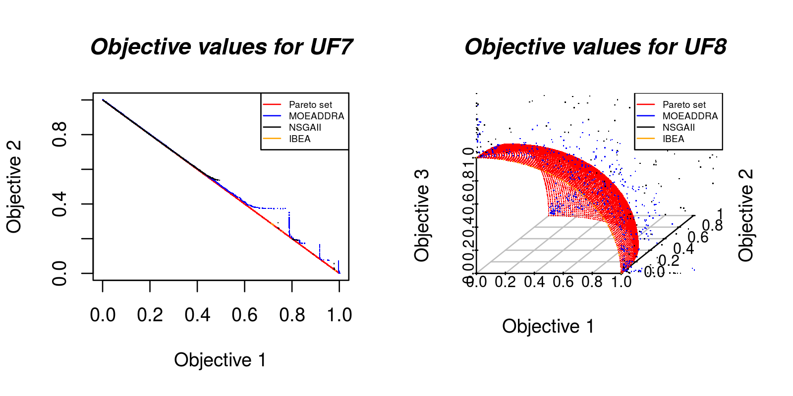

# Multi-Objective-Algorithms-Comparison
Comparison of MOEAs with statistical methods.

This is a independent statistical module for MOEA data. The repository <a href="https://github.com/LucasLP/ExecuteJMetal/">ExecuteJMetal</a> have a auxiliar java code if you need.
 

Install some programs 
<ol type="1">
	<li> You need <b>R Language</b> - for .R files 
		<code>sudo apt-get update</code> 
		<code>sudo apt-get install r-base</code> 
		<code>sudo apt-get install r-base-dev</code> 
		<ol type="1">
		<li> Install <a href="http://iridia.ulb.ac.be/irace/">Irace:</a> 
		  <code>R</code> 
		    <code>install.packages("irace") </code></li>
		 
		<li> Install <a href="https://cran.r-project.org/web/packages/scatterplot3d/index.html">Scatterplot3D</a>, used in new experiment components: 
		  <code>R</code> 
			<code>install.packages("scatterplot3d", repos="http://R-Forge.R-project.org") </code></li>
		 
		<li> Install <a href="https://cran.r-project.org/web/packages/PMCMR/PMCMR.pdf"> PMCMR </a> 
		<code>R</code> 
			<code>install.packages("PMCMR") </code></li>
		 
		</ol>
	</li>
	<li> You need <b>LaTeX</b> - For .tex files 
		<code>sudo apt-get install texlive-full</code> 
		<code>sudo apt install texlive-latex-base</code> 
		<code>sudo apt install texlive-generic-extra</code> 
		<code>sudo apt-get install texlive-latex-extra</code> 
		<code>sudo apt-get install texlive-science</code> 
	</li>
</ol> 

The Scatter Plot of point can be found at "Plots/ScatterPlot.R". 
You can import the scripts and use, like:
<code>R</code> 
<code>source("main.R")</code> 
<code>algorithms = c("MOEADDRA","NSGAII","IBEA")</code> 
<code>objectivePoints("UF7", algorithms)</code> 
<code>objectivePoints3D("UF8", algorithms)</code> 

 
 

<h2>Functions avaible</h2>
#	loadData(algorithm, instance) #Return the data file from instance ant indicator 
#	setBenchmark(benchmark) 
#	bestHV(algorithm, instance) 
#	bestIGD(algorithm, instance) 
#	bestEP(algorithm, instance) 
#	bestIndicators(algorithm, instance) 
#	setBenchmark(benchmark) #example, send "UF" and it will return a array with all of instances in this benchmark 
# 
	source("./Statistics/Counter.R") 
#		countWinners(algorithms, instances) 
#		countAll(algorithm, instance) 
#		countAllinBenchmark(algorithm, benchmark) 
 
 
 
	source("./Statistics/MeanAndStandardDeviation.R") 
#		meanAndStandardDeviationTable(OutputFile, algorithms, problems, indicator) #tex 
# 
	source("./Tex/latexFunctions.R") 
#	#### LATEX FUNCTIONS ####  
#		latexCreate(file) 
#		latexHeader(file) 
#		latexNewSection(file, section) 
#		latexTail(file) 
#  	latexTableHeader(OutputFile,indicator, caption, tabularString, latexTableFirstLine) 
#		latexTableLine(file, line, best) 
#		latexTableTail(file) 
#		latexWinnersTable(file, problem, algorithms) 
#		winnerTables(algorithms, benchmarks) #this files generate a tex file of winner algorithms  
# 
	source("./Plots/ScatterPlot.R") 
#	#### POINT & LINE CHART #### 
#		objectivePoints(instanceName, algorithmsNames) 
#		objectivePoints3D(instanceName, algorithmsNames) 
	source("./Plots/LinePlot.R") 
#		linePlotEvolution(instance, indicator, algorithmsNames) 
 
 
 
 
	source("./Statistics/Kruskal.R") 
#  #### Kruskall-Wallis #### 
#		KruskallWallisTest(algorithms, instance,indicator) #this will print in terminal the comparison of all algorithms 
#		kruskalMain(algorithms,problems,indicator) 
 
#	#### R functions of JMetal (modified) #### 
# 
	source("./Statistics/Wilcoxon.R") 
#		wilcoxonMain(algorithms,problems,indicator) 
# 
	source("./Plots/BoxPlot.R") 
#		JMetalBoxplot(algorithms, indicator, problem) 
 
 
	source("./Tex/latexStatisticalTests.R") 
#		latexMain(algorithms, benchmark)
