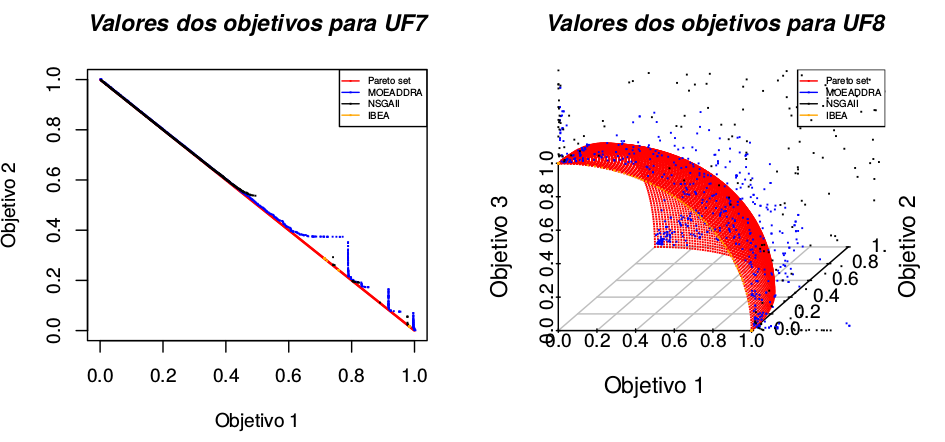

# Multi-Objective-Algorithms-Comparison
Comparison of MOEAs with statistical methods.

This is a independent statistical module for MOEA data. The repository <a href="https://github.com/LucasLP/ExecuteJMetal/">ExecuteJMetal</a> have a auxiliar java code if you need.
 

Install some programs 
<ol type="1">
	<li> You need <b>R Language</b> - for .R files 
		<code>sudo apt-get update</code> 
		<code>sudo apt-get install r-base</code> 
		<code>sudo apt-get install r-base-dev</code> 
		<ol type="1">
		<li> Install <a href="http://iridia.ulb.ac.be/irace/">Irace:</a> 
		  <code>R</code> 
		    <code>install.packages("irace") </code></li>
		 
		<li> Install <a href="https://cran.r-project.org/web/packages/scatterplot3d/index.html">Scatterplot3D</a>, used in new experiment components: 
		  <code>R</code> 
			<code>install.packages("scatterplot3d", repos="http://R-Forge.R-project.org") </code></li>
		 
		<li> Install <a href="https://cran.r-project.org/web/packages/PMCMR/PMCMR.pdf"> PMCMR </a></li> 
		</ol>
	</li>
	<li> You need <b>LaTeX</b> - For .tex files 
		<code>sudo apt-get install texlive-full</code> 
		<code>sudo apt install texlive-latex-base</code> 
		<code>sudo apt install texlive-generic-extra</code> 
		<code>sudo apt-get install texlive-latex-extra</code> 
		<code>sudo apt-get install texlive-science</code> 
	</li>
</ol> 

The Scatter Plot of point can be found at "experiment/MyExperiments/comparison/functions.R". 
You can import the scripts and use, like:
<code>R</code> 
<code>source("functions.R")</code> 
<code>algorithms = c("MOEADDRA","NSGAII","IBEA")</code> 
<code>objectivePoints("UF7", algorithms)</code> 
<code>objectivePoints3D("UF8", algorithms)</code> 

 
 
